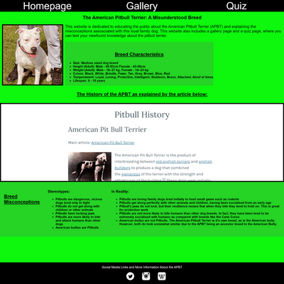
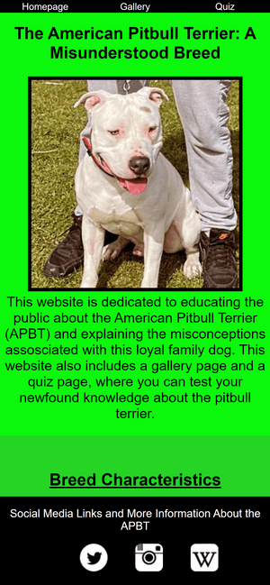
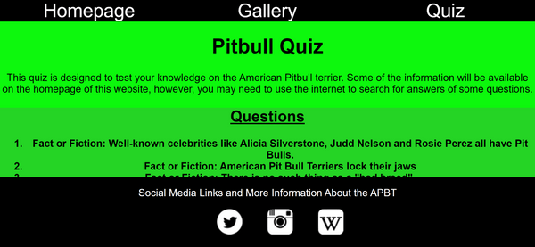
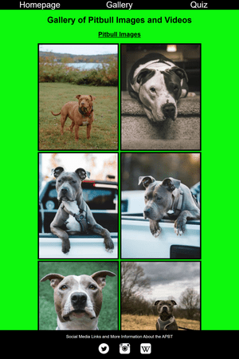

# The Pitbull Information Page

I have created this website to educate people about the American Pitbull Terrier, a highly misunderstood and discriminated against breed of dog. In my website, I have included a homepage (featuring a breed charactersitics section, a breed histroy section and breed misconceptions section), a gallery and a quiz. The homepage educates the public about the Pitbull Terrier whilst the gallery showcases photos and videos of various American Pitbull terriers and the quiz tests users' knowledge about the breed. The target audience of this website is dog lovers and anyone who has a negative opinion about the APBT. This website hopes to change that opinion.

## Screenshots of the Pitbull Information Page on varying devices.

I used google dev tools to emualte different device screens to show responsive design of the website. This responsive design was achieved through the use of media queries and using relative measurement units for the widith and height of elements on the page (vw and vh).  Please see the pictures below for evidence of responsive design

Laptop (Screen Size: 1440 x 1440px)

iPhone 12 Pro (Screen Size: 390 x 844px)

iPhone 12 Pro Landscape (Screen Size 844 x 390px)

Microsoft Surface Pro 7 (Screen Size 912 x 1368 px)

## Features

### Nav bar 

There is a navigation bar at the top of everywebpage that links to each different page, namely the homepage, thee gallery and the quiz page

### Footer

The footer contains social media icons (sourced from [Iconsdb.com]) which link to twitter, instagram and the wikipedia page for American Pitbull Terriers. All links open in new tabs and have aria-labels. All non text elements on the website contain either aria-labels or alt attributes for accessibility. 

### Homepage

On the homepage, there is a picture of a white ABPT accompanied by some text explaining the purpose of the website, as well as a section detailing some characteristics about the dog breed. 

Underneath the breed characteristics, I used an iframe element to link to [https://lillytheheropitbull.com/pit-bull-resources/history-of-the-pitbull/] as this offered great insight into the history of the breed. I set the width of the iframe to 100vw and height to 400px for responsive design. 

Underneath the iframe element, which is in the breed history section, there is a breed misconceptions section. This lists breed stereotypes as well as the opposing facts abput the breeds under the title "In reality."

Image of Homepage:

### Gallery

In the gallery, I divided images and videos into their own sections. The images were sourced from [https://unsplash.com/s/photos/dog-pitbull],[https://www.istockphoto.com/search/2/image?phrase=pitbull] or my personal gallery. The videos are both from my personal gallery. For the videos, I inluded video controls and muted them so they would not play automatically upon loading the page.

Images of gallery section:

!(Image of images section of gallery)
